### Contact Eric if you know of a good home for any of these items.
-  E & D  are downsizing and hate to put these items in the dumpster.
   -  Free to a good home
   -  Possible Fee for Middlemen.

- They used to call these "Girls Bikes.  IT's a Schwinn 15 Speed from the 80's  
<a href="./GoodPics/BIke.jpg"> 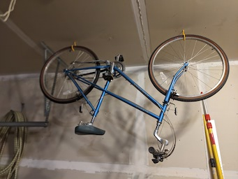 </a>  

-  Complete Bernina Sewing Machine will everything that came in the box. 
<a href="./GoodPics/Bernina.jpg"> 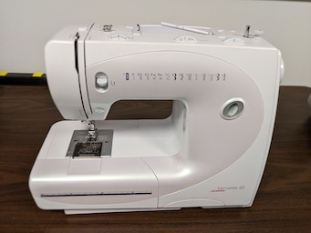 </a>  
   
-  A core-Duo MACBook Pro with a new battery.  Office Installed!  (High end in early 2000's) 
<a href="./GoodPics/Mac-Pro.jpg"> 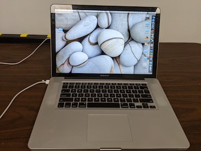 </a>  
   
-  A Lenovo  T510 I7 Classic Notebook  (Another high end computer in it's day.) 
<a href="./GoodPics/T510.jpg"> 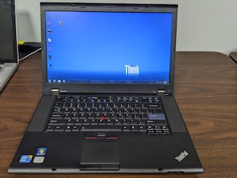 </a>  
   
-  A standard 3' by 5' steel and wood utility table. 
<a href="./GoodPics/Table.png"> 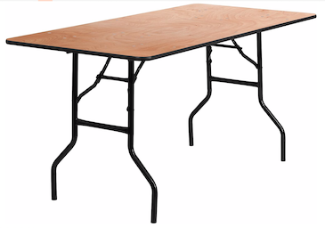 </a>  
   
- A Celestron Refractor Telescope with Equatorial mount and tripod. 
<a href="./GoodPics/Telescope-1.jpg"> 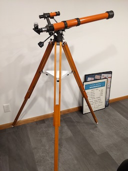 </a>  
  
-  A Shop Vac  
<a href="./GoodPics/Shop-Vac.jpg"> 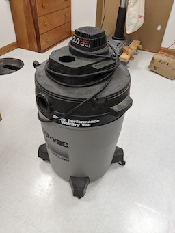 </a>  
   
- A 1950 Classic Singer Featherweight model 221.  Collectable (Google it!) 
  - Includes Offcial Singer worktable.  (Cutout for Machine for flush sewing action!)
  - Rebuilt with the FeatherWeight Doctor's kit.  [See Featherweightdoctor.com](https://featherweightdoctor.com) 
<a href="./GoodPics/Singer.jpg"> 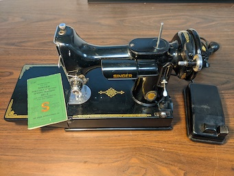 </a>  
   
- A Recently restored Table Saw - Direct Drive and Smooth running. 
<a href="./GoodPics/Table-Saw.jpg"> 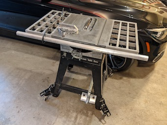 </a>  
  
-  A Sears Craftsman Tool Chest with some tools.  Ask Eric what's inside.  
<a href="./GoodPics/Tool-Cabinet-1.jpg"> 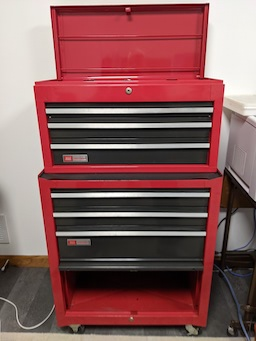 </a>  
   
-  A "real" Oxy / Acetaline torch outfit with cutting tool and welding tips. 
<a href="./GoodPics/Torch-2.jpg"> 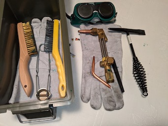 </a>  

-  The rest of the Torch 
<a href="./GoodPics/Torch.jpg"> 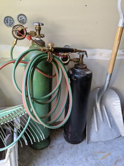 </a>  

-  A completely restored Marx HO train set from the early 60's -  Classic with extra track.    
<a href="./GoodPics/Train.jpg"> 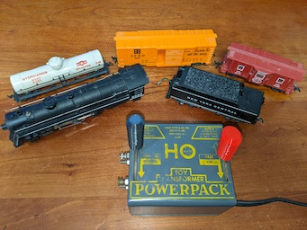 </a>  
